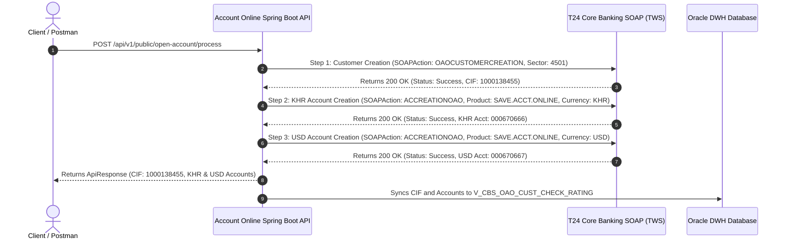

# Standard Account Online Opening — T24 SOAP Integration Guide

This guide documents the verified, end-to-end **Standard Account Online Opening** workflow for integration with Temenos T24 Core Banking.

---

## 1. T24 Environment & Endpoint Configuration

| Parameter | Value |
| :--- | :--- |
| **T24 Web Services Base URL** | `http://192.168.127.31:7003` |
| **SOAP Endpoint URL** | `http://192.168.127.31:7003/TWS.CPBOAO/services` |
| **HTTP Method** | `POST` |
| **Content-Type** | `text/xml; charset=UTF-8` |
| **T24 Username** | `LEANGHOURNG.PHOEUNG` |
| **T24 Password** | `LEang@321` |
| **Company Code** | `KH0012011` |

---

## 2. Key T24 Mapping Parameters

| Parameter | Field Name | Code / Value | Description |
| :--- | :--- | :--- | :--- |
| **Customer Sector** | `<cus:Sector>` | `4501` | Required sector code registered in T24 `SECTOR` database table |
| **Product Code** | `<aaar:Product>` | `SAVE.ACCT.ONLINE` | Standard Online Savings Account Product |
| **Cost Center** | `<cus:CostCenter>` | `1000` | Fallback cost center |
| **Industry** | `<cus:Industry>` | `4500` | Fallback industry classification |
| **Target** | `<cus:Target>` | `220` | Target market segment |
| **Customer Type** | `<cus:CustomerType>`| `ACTIVE` | Customer status type |

---

## 3. Step-by-Step T24 Execution Flow



---

## 4. Complete Verified SOAP Request XML Payloads

### Step 1: Create Customer (CIF)
- **SOAPAction Header**: `OAOCUSTOMERCREATION`

```xml
<?xml version="1.0" encoding="UTF-8"?>
<soapenv:Envelope xmlns:soapenv="http://schemas.xmlsoap.org/soap/envelope/"
                  xmlns:oaow="http://temenos.com/OAOWAR"
                  xmlns:cus="http://temenos.com/CUSTOMERCPBCREATEOAO">
    <soapenv:Header/>
    <soapenv:Body>
        <oaow:OAOCUSTOMERCREATION>
            <WebRequestCommon>
                <company>KH0012011</company>
                <password>LEang@321</password>
                <userName>LEANGHOURNG.PHOEUNG</userName>
            </WebRequestCommon>
            <OfsFunction/>
            <CUSTOMERCPBCREATEOAOType id="">
                <!-- Short Name -->
                <cus:gSHORTNAME g="1">
                    <cus:ShortName>PHAT MENGHOR</cus:ShortName>
                    <cus:ShortName>ផាត់ ម៉េងហ័រ</cus:ShortName>
                </cus:gSHORTNAME>

                <!-- Full Name -->
                <cus:gNAME1 g="1">
                    <cus:FullName>PHAT MENGHOR</cus:FullName>
                    <cus:FullName>ផាត់ ម៉េងហ័រ</cus:FullName>
                </cus:gNAME1>

                <!-- Legal Address -->
                <cus:gSTREET g="1">
                    <cus:STREET>Phnom Penh Cambodia</cus:STREET>
                </cus:gSTREET>

                <!-- Sector 4501 -->
                <cus:Sector>4501</cus:Sector>
                <cus:CostCenter>1000</cus:CostCenter>
                <cus:Industry>4500</cus:Industry>
                <cus:Target>220</cus:Target>
                <cus:Nationality>KH</cus:Nationality>
                <cus:CustomerStatus>1</cus:CustomerStatus>
                <cus:Residence>KH</cus:Residence>

                <!-- Legal Identification -->
                <cus:gLEGALID g="1">
                    <cus:mLEGALID m="1">
                        <cus:LegalId>031096042</cus:LegalId>
                        <cus:LegalDocName>NATIONAL.ID</cus:LegalDocName>
                        <cus:LegalHolderName>NATIONAL.ID</cus:LegalHolderName>
                        <cus:LegalIssAuth>MENGHOR</cus:LegalIssAuth>
                        <cus:LegalIssDate>20200101</cus:LegalIssDate>
                        <cus:LegalExpDate>20300101</cus:LegalExpDate>
                    </cus:mLEGALID>
                </cus:gLEGALID>

                <!-- Language & Rating -->
                <cus:Language>2</cus:Language>
                <cus:gCUSTOMERRATING g="1">
                    <cus:CustomerRating>1</cus:CustomerRating>
                </cus:gCUSTOMERRATING>

                <!-- Personal Details -->
                <cus:TITLE>MR</cus:TITLE>
                <cus:GIVENNAMES>MENGHOR</cus:GIVENNAMES>
                <cus:FAMILYNAME>PHAT</cus:FAMILYNAME>
                <cus:Gender>MALE</cus:Gender>
                <cus:DateofBirth>19950820</cus:DateofBirth>
                <cus:MaritalStatus>SINGLE</cus:MaritalStatus>

                <!-- Phone & SMS -->
                <cus:gPHONE1 g="1">
                    <cus:mPHONE1 m="1">
                        <cus:PHONE1>012345678</cus:PHONE1>
                        <cus:SMS1>012345678</cus:SMS1>
                        <cus:EMAIL1/>
                    </cus:mPHONE1>
                </cus:gPHONE1>

                <!-- Customer Type -->
                <cus:CustomerType>ACTIVE</cus:CustomerType>

                <!-- Current Address Codes -->
                <cus:CustProvince>12</cus:CustProvince>
                <cus:CustDistrict>1201</cus:CustDistrict>
                <cus:CustCommune>120101</cus:CustCommune>
                <cus:CustVillage>12010101</cus:CustVillage>

                <!-- Ownership & Staff -->
                <cus:Ownership>304</cus:Ownership>
                <cus:RelationManager></cus:RelationManager>
                <cus:LoanOfficer></cus:LoanOfficer>
                <cus:Staff></cus:Staff>
                <cus:ReferralBy></cus:ReferralBy>

                <!-- Place of Birth Address Codes -->
                <cus:CUSTPROVINCEP>12</cus:CUSTPROVINCEP>
                <cus:CUSTDISTRICTP>1201</cus:CUSTDISTRICTP>
                <cus:CUSTCOMMUNEP>120101</cus:CUSTCOMMUNEP>
                <cus:CUSTVILLAGEP>12010101</cus:CUSTVILLAGEP>
            </CUSTOMERCPBCREATEOAOType>
        </oaow:OAOCUSTOMERCREATION>
    </soapenv:Body>
</soapenv:Envelope>
```

---

### Step 2: Create KHR Account
- **SOAPAction Header**: `ACCREATIONOAO`

```xml
<?xml version="1.0" encoding="UTF-8"?>
<soapenv:Envelope xmlns:soapenv="http://schemas.xmlsoap.org/soap/envelope/"
                  xmlns:oaow="http://temenos.com/OAOWAR"
                  xmlns:aaar="http://temenos.com/AAARRANGEMENTACTIVITYAANEWOAO">
    <soapenv:Header/>
    <soapenv:Body>
        <oaow:ACCREATIONOAO>
            <WebRequestCommon>
                <company>KH0012011</company>
                <password>LEang@321</password>
                <userName>LEANGHOURNG.PHOEUNG</userName>
            </WebRequestCommon>
            <OfsFunction/>
            <AAARRANGEMENTACTIVITYAANEWOAOType id="">
                <aaar:Arrangement>NEW</aaar:Arrangement>
                <aaar:Activity>ACCOUNTS-NEW-ARRANGEMENT</aaar:Activity>

                <!-- Customer Owner CIF -->
                <aaar:gCUSTOMER g="1">
                    <aaar:mCUSTOMER m="1">
                        <aaar:Customer>1000138455</aaar:Customer>
                        <aaar:CustomerRole>OWNER</aaar:CustomerRole>
                    </aaar:mCUSTOMER>
                </aaar:gCUSTOMER>

                <!-- Product & Currency -->
                <aaar:Product>SAVE.ACCT.ONLINE</aaar:Product>
                <aaar:Currency>KHR</aaar:Currency>

                <!-- Property Titles -->
                <aaar:gPROPERTY g="1">
                    <aaar:mPROPERTY m="1">
                        <aaar:Property>BALANCE</aaar:Property>
                        <aaar:sgFIELDNAME sg="1">
                            <aaar:FieldName s="1">
                                <aaar:FieldName>SHORT.TITLE:1</aaar:FieldName>
                                <aaar:FieldValue>PHAT MENGHOR</aaar:FieldValue>
                            </aaar:FieldName>
                            <aaar:FieldName s="1">
                                <aaar:FieldName>SHORT.TITLE:2</aaar:FieldName>
                                <aaar:FieldValue>ផាត់ ម៉េងហ័រ</aaar:FieldValue>
                            </aaar:FieldName>
                            <aaar:FieldName s="1">
                                <aaar:FieldName>ACCOUNT.TITLE.1:1</aaar:FieldName>
                                <aaar:FieldValue>PHAT MENGHOR</aaar:FieldValue>
                            </aaar:FieldName>
                            <aaar:FieldName s="1">
                                <aaar:FieldName>ACCOUNT.TITLE.1:2</aaar:FieldName>
                                <aaar:FieldValue>ផាត់ ម៉េងហ័រ</aaar:FieldValue>
                            </aaar:FieldName>
                        </aaar:sgFIELDNAME>
                    </aaar:mPROPERTY>
                </aaar:gPROPERTY>
            </AAARRANGEMENTACTIVITYAANEWOAOType>
        </oaow:ACCREATIONOAO>
    </soapenv:Body>
</soapenv:Envelope>
```

---

### Step 3: Create USD ($) Account
- **SOAPAction Header**: `ACCREATIONOAO`

```xml
<?xml version="1.0" encoding="UTF-8"?>
<soapenv:Envelope xmlns:soapenv="http://schemas.xmlsoap.org/soap/envelope/"
                  xmlns:oaow="http://temenos.com/OAOWAR"
                  xmlns:aaar="http://temenos.com/AAARRANGEMENTACTIVITYAANEWOAO">
    <soapenv:Header/>
    <soapenv:Body>
        <oaow:ACCREATIONOAO>
            <WebRequestCommon>
                <company>KH0012011</company>
                <password>LEang@321</password>
                <userName>LEANGHOURNG.PHOEUNG</userName>
            </WebRequestCommon>
            <OfsFunction/>
            <AAARRANGEMENTACTIVITYAANEWOAOType id="">
                <aaar:Arrangement>NEW</aaar:Arrangement>
                <aaar:Activity>ACCOUNTS-NEW-ARRANGEMENT</aaar:Activity>

                <!-- Customer Owner CIF -->
                <aaar:gCUSTOMER g="1">
                    <aaar:mCUSTOMER m="1">
                        <aaar:Customer>1000138455</aaar:Customer>
                        <aaar:CustomerRole>OWNER</aaar:CustomerRole>
                    </aaar:mCUSTOMER>
                </aaar:gCUSTOMER>

                <!-- Product & Currency -->
                <aaar:Product>SAVE.ACCT.ONLINE</aaar:Product>
                <aaar:Currency>USD</aaar:Currency>

                <!-- Property Titles -->
                <aaar:gPROPERTY g="1">
                    <aaar:mPROPERTY m="1">
                        <aaar:Property>BALANCE</aaar:Property>
                        <aaar:sgFIELDNAME sg="1">
                            <aaar:FieldName s="1">
                                <aaar:FieldName>SHORT.TITLE:1</aaar:FieldName>
                                <aaar:FieldValue>PHAT MENGHOR</aaar:FieldValue>
                            </aaar:FieldName>
                            <aaar:FieldName s="1">
                                <aaar:FieldName>SHORT.TITLE:2</aaar:FieldName>
                                <aaar:FieldValue>ផាត់ ម៉េងហ័រ</aaar:FieldValue>
                            </aaar:FieldName>
                            <aaar:FieldName s="1">
                                <aaar:FieldName>ACCOUNT.TITLE.1:1</aaar:FieldName>
                                <aaar:FieldValue>PHAT MENGHOR</aaar:FieldValue>
                            </aaar:FieldName>
                            <aaar:FieldName s="1">
                                <aaar:FieldName>ACCOUNT.TITLE.1:2</aaar:FieldName>
                                <aaar:FieldValue>ផាត់ ម៉េងហ័រ</aaar:FieldValue>
                            </aaar:FieldName>
                        </aaar:sgFIELDNAME>
                    </aaar:mPROPERTY>
                </aaar:gPROPERTY>
            </AAARRANGEMENTACTIVITYAANEWOAOType>
        </oaow:ACCREATIONOAO>
    </soapenv:Body>
</soapenv:Envelope>
```

---

## 5. Oracle Database Verification SQL Queries

To verify that the newly created CIF and accounts exist in the Oracle DWH database:

```sql
-- Query by Legal ID
SELECT ACCT, MNEMONIC, CUSTOMERCIF, CUSTOMER_RATING 
FROM V_CBS_OAO_CUST_CHECK_RATING 
WHERE LEGAL_ID = '031096042';

-- Query by Customer CIF
SELECT ACCT, MNEMONIC, CUSTOMERCIF, CUSTOMER_RATING 
FROM V_CBS_OAO_CUST_CHECK_RATING 
WHERE CUSTOMERCIF = '1000138455';
```
